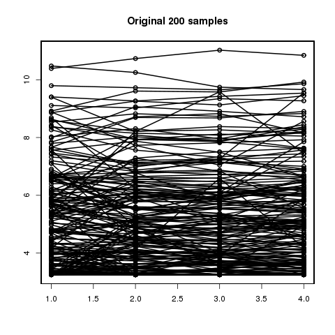
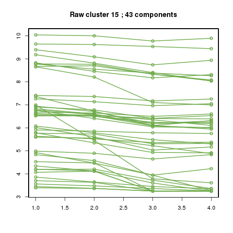
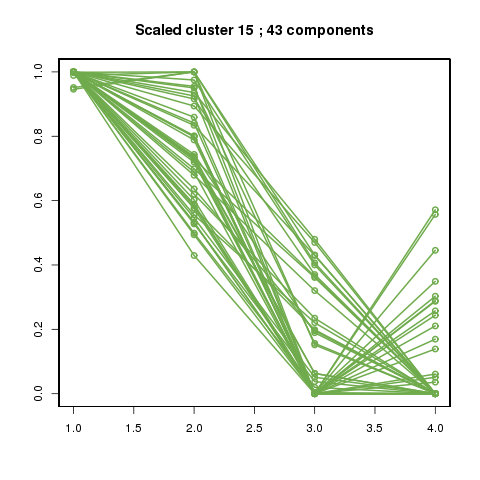
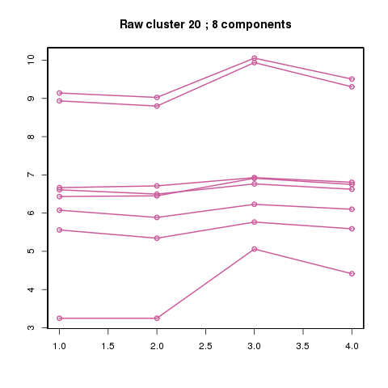
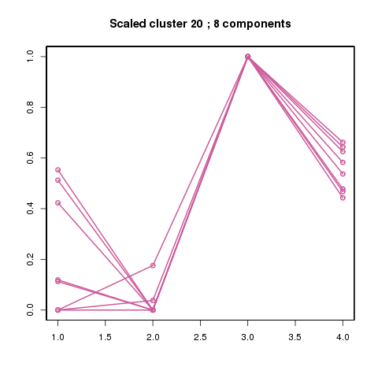

Let's say that we are looking at a large number of time series (about 30,000 in initData.csv).  If we can take a random sample
of 200 of them and plot them, we get something like the image below:

Unfortunately, it is not very clear what to see in such a picture.  In order to help find some order, one may wish to
group these time series into N (= 20 in our case) clusters according to how similar to each other.  You can see below examples for a couple of clusters.  Note that the similarity is more visible when those time series are all normalized to lie on the same scale (0 = their lowest point & 1 = their highest point)

